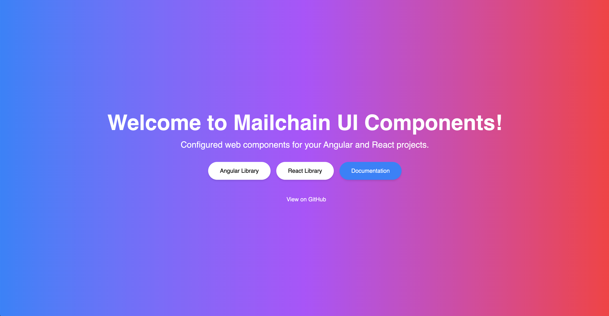

# Mailchain UI Components

Welcome to the documentation for [Mailchain UI Components](https://www.npmjs.com)! This is a versatile and modern npm package that uses [Stencil](https://stenciljs.com/) to build a monorepo of two powerful libraries: `react-ui-components` and `angular-ui-components`. Our goal is to provide a seamless and consistent user interface (UI) experience across popular JavaScript frameworks such as [Angular](https://angular.io/), [React](https://reactjs.org/), and [Next.js](https://nextjs.org/).

## Features

- 🚀 Built with [Stencil](https://stenciljs.com/): A powerful toolchain for building reusable, scalable, and future-proof web components.
- 🔧 Monorepo structure: Manage `react-ui-components` and `angular-ui-components` within a single repository.
- ⚡️ Web Components: Create custom elements that work seamlessly across Angular, React, and Next.js applications.
- 🌐 Framework-agnostic: Use the same UI components across different JavaScript frameworks with ease.
- 📚 Comprehensive documentation: Clear and concise docs to help you get started and make the most of the library.

## Getting Started

To get started with Mailchain UI Components, follow the step-by-step instructions in our [Installation docs](https://mailchain.saugardev.com/docs), which covers everything you need to know to set up and use the library in your projects.

## Support and Questions

If you have any questions, issues, or need help, please create an issue on our [GitHub repository](https://github.com/saugardev/mailchain-ui-components/issues), and we'll do our best to assist you.

We hope you enjoy using Mailchain UI Components and find it valuable in building your applications! 🎉

## Website

[Website Link](https://mailchain.saugardev.com)
[Video Link](https://youtu.be/C4EhlalmWnw)
